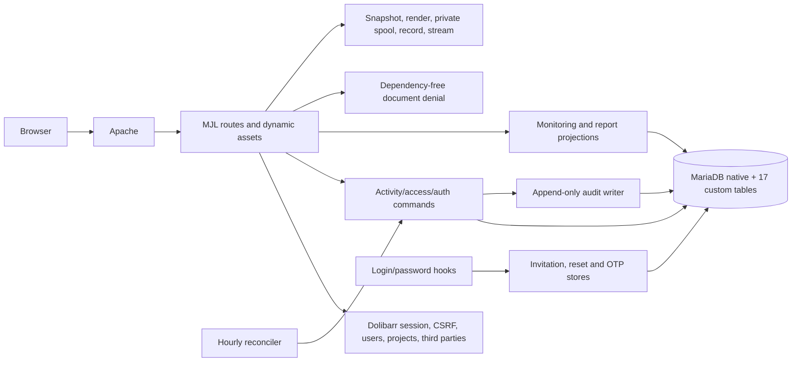

# Current architecture

## System boundary

MJL Financement is a Dolibarr custom module. Dolibarr owns authentication primitives, sessions, CSRF helpers, users, third parties, projects, ECM integration, module lifecycle, mail, PDF and spreadsheet libraries. The module owns the MJL role projection, invitation/reset/OTP lifecycle, Activity workflow, monitoring projections, deny-only document boundaries, exports and audit history. MariaDB enforces selected invariants that must survive direct or concurrent writes.

## Runtime layers

| Layer | Responsibility | Principal seams |
| --- | --- | --- |
| module/lifecycle | dependencies, rights, menus, hooks, CSS, cron and schema activation | module descriptor, SQL/update scripts, bootstrap |
| HTTP routes | bootstrap, input normalization, direct authorization, CSRF, redirects and rendering | 18 application routes |
| dynamic frontend assets | server-aware auth/native-guard behavior and CSS delivery | 3 dynamic asset endpoints plus static JS/CSS/templates |
| access/auth | effective role, scope, invitation, reset, OTP and credential revocation | login hooks, access classes/libraries |
| aggregate writes | planning, revision, review, execution, cancellation, reopening and reconciliation | `MjlActivityCommand`, assignment and reference writers |
| projections | dashboards, queues, monitoring reports, audit views and presentation eligibility | `MjlMonitoring` and report/presentation helpers |
| documents | deny all current custom document requests and block native document paths | dependency-free 403 endpoints plus Apache rules; authorized delivery is deferred |
| exports | server filters, repeatable snapshot, private render/spool, locking, audit and delivery | report routes, renderer and export class |
| database boundary | entity isolation, uniqueness, immutability, authorization-related invariants and audit durability | 17 custom tables, native Dolibarr tables and triggers |
| verification | unit contracts, PHP contracts, disposable tenant/container modes, Playwright and manual accessibility | four runners and their helpers/fixtures |

## Data and transaction boundaries

The Activity aggregate is the primary business write boundary. It coordinates Activity state, revisions, contributors, review decisions, Operations, cancellation/reopening requests and audit entries under locks. Assignment and reference management are secondary write owners. Native Societe and Project objects remain adapters rather than duplicated MJL entities.

Monitoring and reports are read projections. They do not authorize writes. The UI may hide unavailable actions, but routes and commands re-check authorization and state. Critical entity/role/audit rules are duplicated in database constraints or triggers where application checks alone cannot protect concurrency or alternate writers.

Exports cross two completion boundaries: durable generation/audit and HTTP delivery. `GENERATED` intentionally records the complete private artifact before streaming, and existing E2E source preserves that evidence after a client abort. Server-side `fread()` failure handling remains an untested reliability gap.

## Authentication and authorization

The retained native technical administrator maps to ADMIN. Business accounts derive exactly one effective MJL role in the active entity. Invitations, password reset and OTP store digests or bound state rather than reusable plaintext credentials. Assignment limits Agent visibility. Authorization is layered across UI eligibility, routes, command locks and database invariants.

The target reset trigger conflicts with a reset request for the entity-0 retained Admin when the request uses an active business entity. That source-level contradiction prevents a complete claim for the target authentication lifecycle.

## Lifecycle modes

The module detects unavailable, predecessor and current schema states. Activation uses named locks, guards and exact-definition recognition because MariaDB DDL is not wholly transactional. The clean bootstrap keeps one native technical administrator and no persistent business sample data. Test data belongs only to disposable isolated tenants.

## Architecture health

The strongest seams are thin guarded routes, one Activity aggregate command, entity-scoped projections, transaction-bound audit, deny-only document boundaries and isolated test fixtures. The main risks are the retained Admin reset contradiction, unchecked reference transaction results, activation interruption complexity, cron failure/entity semantics and verification runners whose names overstate actual discovery. Export streaming has a narrower server-read error-handling gap.

No target architecture is asserted by this audit. Future changes should start from the preservation ledger and gap analysis, characterize the affected trust boundary, and implement only the smallest approved correction.
