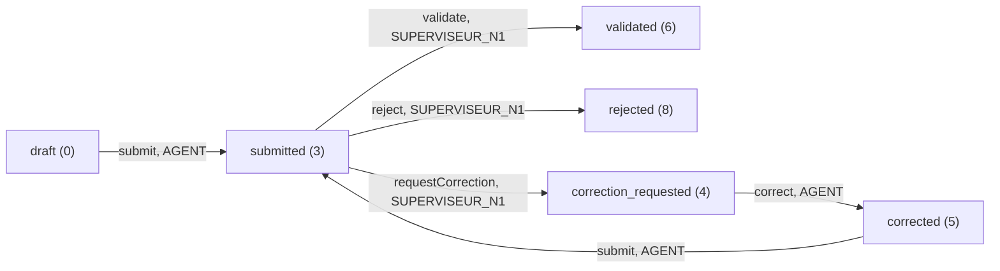
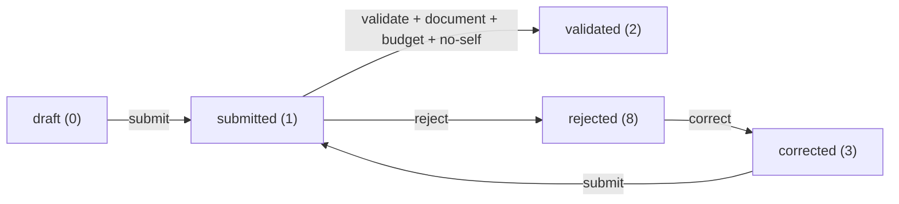

# MJL Current App Functional Map

## 1. Executive summary

The current application is a custom MJL workspace inside Dolibarr, not a
standalone application. Dolibarr provides the runtime, authentication shell,
native users/groups/rights, third parties, projects/tasks, ECM storage, and
export helper support. The MJL user experience is mostly implemented in
`custom/mjlfinancement` through custom pages, classes, SQL tables, CSS, JS,
templates, hooks, and helper libraries.

The current functional center of gravity is custom MJL project financing
follow-up: activity workflow, expense workflow, guarded supporting documents,
DPAF/Admin supervision, alerts, exports, project notes, and traceability. This
is visible in `modMjlFinancement.class.php`, which declares custom rights for
conventions, activities, budget lines, expenses, fund receipts, validations,
workflow actions, exchange logs, reports, and exports.

Production-like parts include server-side route guards, active-entity filters
in custom queries, guarded document downloads, no-self-validation checks,
Excel-readable exports, invitation-only access, and audit/history tables. The
POC/scaffolding parts include sample-data-driven roles, the unfinished N1/N2
role split, hidden exchange logs, an internal roadmap page controlled by
`MJL_SHOW_INTERNAL_ROADMAP`, and current-state docs that sometimes lag behind
code. Runtime tenant state is `Not verified`; this document audits repository
implementation.

## 2. Current technical structure

| Area | Current implementation | Evidence | Notes |
| --- | --- | --- | --- |
| Main module path | Custom module under `custom/mjlfinancement`. | `custom/mjlfinancement/*` | MJL-specific code is contained in the custom module and docs. |
| Module descriptor | `modMjlFinancement`, version `0.8.0`, family `financial`, rights class `mjlfinancement`. | `custom/mjlfinancement/core/modules/modMjlFinancement.class.php` | Declares module rights and one Dolibarr top menu entry. |
| Native dependencies | Third parties, projects, ECM/documents, exports. | `$this->depends = array('modSociete', 'modProjet', 'modECM', 'modExport')` in `modMjlFinancement.class.php` | Dolibarr native modules are used as backend capabilities. |
| Module parts | Custom CSS, JS, templates, hooks `all`, `login`, `passwordforgottenpage`. | `module_parts` in `modMjlFinancement.class.php` | Hooks support auth/native-guard behavior. |
| Dolibarr top menu | One top menu routes to `/custom/mjlfinancement/index.php`. | `$this->menu` in `modMjlFinancement.class.php` | No Dolibarr left-menu tree is declared. |
| Workspace navigation | Custom grouped sidebar generated in PHP. | `mjl_navigation_sections()` and `mjl_navigation_shell_start()` in `lib/mjl_navigation.lib.php` | This is the main app navigation. |
| Access/capabilities | Capability helpers combine admin, DPAF group, and MJL rights. | `lib/mjl_workspace.lib.php` | `MJL POC - DPAF` group grants supervision behavior. |
| Main page controllers | Dashboard, projects, activities, expenses, documents, alerts, finance/reference pages, supervision, exports, audit, invitations. | PHP routes in `custom/mjlfinancement/*.php` and `admin/access.php` | Each route has its own guard. |
| Object classes | Custom classes for convention, activity, budget line, fund receipt, expense, validation, workflow action, exchange log, report. | `custom/mjlfinancement/class/*.class.php` | Classes contain lifecycle and persistence logic. |
| Libraries | Auth, email, workspace, navigation, dashboard, alerts, documents, reporting, CSV/XLSX export, integrity, workflow audit. | `custom/mjlfinancement/lib/*.lib.php` | Shared behavior is mostly in custom libs. |
| SQL schema | Custom `llx_mjlfinancement_*` tables plus indexes/FKs. | `custom/mjlfinancement/sql/*.sql` | Fresh install schema plus update scripts through `update_0.8.0.sql`. |
| Assets/templates | MJL app/auth CSS, native guard JS, login/password templates. | `css/mjl_app.css.php`, `css/mjl_auth.css.php`, `js/native_guard.js.php`, `core/tpl/*.tpl.php` | UI/auth customization without Dolibarr core edits. |
| Hooks | Login/password/native workspace hooks. | `class/actions_mjlfinancement.class.php` | Redirects restricted native routes for non-admin MJL users. |
| Feature flags/config | `MJL_SHOW_INTERNAL_ROADMAP`, `MJL_POC_DEFAULT_PASSWORD`, E2E auth/email constants. | `lib/mjl_workspace.lib.php`, `scripts/bootstrap_poc.php`, `lib/mjl_auth.lib.php`, `lib/mjl_email.lib.php` | Roadmap defaults to `0` in bootstrap. Runtime value is `Not verified`. |

## 3. Navigation map

The current source of truth is `mjl_navigation_sections(User $targetUser)` in
`custom/mjlfinancement/lib/mjl_navigation.lib.php`. A separate Dolibarr top
menu entry points to the MJL dashboard from `modMjlFinancement.class.php`.

| Navigation label | URL/file | Visible by default? | Required permission/role | Purpose | Evidence |
| --- | --- | --- | --- | --- | --- |
| Dolibarr top: MJLFinancement | `/custom/mjlfinancement/index.php` | Yes, for users with at least one MJL read right | Any listed MJL read right in menu `perms` | Entry from native Dolibarr menu into MJL workspace | `modMjlFinancement.class.php` menu entry |
| Tableau de bord | `index.php` | Yes when user can enter workspace | Any MJL read right via `mjl_workspace_user_can_read()` | Role-aware workspace dashboard | `mjl_navigation_sections()`, `index.php` |
| Projets | `projects.php` | Yes when project-capable | Activity/expense/convention/budget/fund receipt read capability | MJL wrapper over native projects and notes | `mjl_workspace_can_access_projects()`, `projects.php` |
| Activites | `activities.php` | Yes with `activity/read` | `mjlfinancement/activity/read` | Activity list/detail/workflow/documents | `mjl_navigation_sections()`, `activities.php` |
| Liste des activites | `activities.php` | Visible as active child | `activity/read` | Activity list child link | `mjl_navigation_sections()` |
| Alertes activites | `alerts.php?scope=activities` | Visible as child when alerts readable | Activity or expense read via `mjl_alerts_user_can_read()` | Activity-risk shortcut | `mjl_navigation_sections()`, `lib/mjl_alerts.lib.php` |
| Depenses | `expenses.php` | Yes with `expense/read` | `mjlfinancement/expense/read` | Expense list/detail/workflow/documents | `mjl_navigation_sections()`, `expenses.php` |
| Liste des depenses | `expenses.php` | Visible as active child | `expense/read` | Expense list child link | `mjl_navigation_sections()` |
| Alertes depenses | `alerts.php?scope=expenses` | Visible as child when alerts readable | Activity or expense read via `mjl_alerts_user_can_read()` | Expense-risk shortcut | `mjl_navigation_sections()`, `lib/mjl_alerts.lib.php` |
| Documents | `documents.php` | Yes when document-capable | Activity/expense read or supervised convention/fund receipt read | Read-only document library | `mjl_workspace_can_access_documents()`, `documents.php` |
| Bibliotheque | `documents.php` | Visible as active child | Same as Documents | Document library child link | `mjl_navigation_sections()` |
| Financement | First visible child, usually `conventions.php` | Only when finance children exist | Supervision plus specific read rights | Finance/reference group | `mjl_navigation_sections()` |
| Conventions | `conventions.php` | DPAF/Admin with `convention/read` | Supervision plus `convention/read`; writes require `convention/write` | Governed conventions/funding envelopes | `mjl_workspace_require_reference_data_access()`, `conventions.php` |
| Budgets | `budgetlines.php` | DPAF/Admin with `budgetline/read` | Supervision plus `budgetline/read`; writes require `budgetline/write` | Budget-line management | `budgetlines.php`, `mjl_budgetlines_can_manage()` |
| Fonds recus | `fundreceipts.php` | DPAF/Admin with `fundreceipt/read` | Supervision plus `fundreceipt/read`; writes require `fundreceipt/write` | Fund receipt/proof management | `fundreceipts.php`, `mjl_fundreceipts_can_manage()` |
| Supervision | First visible supervision child | Yes for supervision/reviewer/audit capabilities | Depends on child | DPAF, validation history, alerts, reports, audit | `mjl_navigation_sections()` |
| Tableau DPAF | `dpafdashboard.php` | DPAF/Admin | Admin or user in `MJL POC - DPAF` | Portfolio supervision dashboard | `mjl_workspace_require_supervision_access()`, `dpafdashboard.php` |
| Historique des validations | `validations.php` | Eligible reviewers/supervision/audit | `mjl_workspace_can_access_validation_history()` | Expense validation history | `validations.php`, `mjl_workspace_can_access_validation_history()` |
| Alertes globales | `alerts.php` | Users with alert read | Activity or expense read | Global alert list | `alerts.php`, `mjl_alerts_user_can_read()` |
| Rapports / Exports | `reports.php` | DPAF/Admin | Supervision; export action requires Admin or `export/write` | Report/export center | `mjl_navigation_sections()`, `reports.php` |
| Historique / Audit | `workflowactions.php` | Advanced eligible users | `workflowaction/read` plus supervision/admin or non-operational audit profile | Advanced workflow audit | `workflowactions.php`, `mjl_workspace_can_access_advanced_traceability()` |
| Administration | `admin/access.php` | Admin only | `$user->admin` | Admin group | `mjl_navigation_sections()` |
| Invitations | `admin/access.php` | Admin only | `$user->admin` | Invitation-only access management | `admin/access.php` |
| Preparation production | `roadmap.php` | Hidden unless configured | Admin plus `MJL_SHOW_INTERNAL_ROADMAP=1` | Internal roadmap/readiness page | `mjl_workspace_can_access_roadmap()`, `roadmap.php` |
| Echanges MJL | `exchangelogs.php` | No normal sidebar link | Advanced traceability access plus `exchangelog/read`; create needs `exchangelog/write` | Exchange log page | `exchangelogs.php`; no item in `mjl_navigation_sections()` |
| Guarded document download | `documentdownload.php` | Not navigation | Object-specific document guards | Downloads ECM files through MJL route | `documentdownload.php`, `lib/mjl_document.lib.php` |
| Invitation acceptance | `invitation.php` | Not navigation | Public token flow, `NOLOGIN` | Accept invitation and set password | `invitation.php`, `lib/mjl_auth.lib.php` |

`reports.php` is currently under the `supervision` section in code. Any doc
that places it under finance is stale relative to
`custom/mjlfinancement/lib/mjl_navigation.lib.php`.

## 4. Page-by-page functional inventory

| Page name | File path | Allows user to do | Reads | Writes | Access | Reachable from navigation | Classification / limitations |
| --- | --- | --- | --- | --- | --- | --- | --- |
| Dashboard | `custom/mjlfinancement/index.php` | View role-aware cards, metrics, quick links, alerts context. | Workspace metrics, dashboard metrics, alerts count. | None. | `mjl_workspace_user_can_read()`. | Yes. | Complete enough for POC; runtime metrics depend on DB state. |
| Projects | `custom/mjlfinancement/projects.php` | List projects, open project detail, view related activities/expenses/documents, add project notes. | Native `llx_projet`, custom objects, `llx_ecm_files`, `llx_mjlfinancement_project_note`. | Inserts project notes and workflow audit on `add_note`. | `mjl_workspace_require_projects_access()` plus scoped open checks. | Yes. | Complete enough for POC; native project creation is not provided here. |
| Activities | `custom/mjlfinancement/activities.php` | Create activity draft, edit limited fields, submit, validate, reject, return for correction, correct, upload documents. | `llx_mjlfinancement_activity`, convention/project/task data, documents, workflow audit. | Activity rows, ECM files, workflow actions. | `activity/read`; actions require write/validate and object scope. | Yes. | Complete enough for POC; N2-specific review is not distinct in code. |
| Expenses | `custom/mjlfinancement/expenses.php` | Create expense draft, upload supporting document, submit, validate, reject, correct/resubmit. | Expenses, projects, conventions, activities, budget lines, ECM files, validations. | Expense rows, ECM files, validation events, budget-line recalculation. | `expense/read`; actions require write/validate and object scope. | Yes. | Complete enough for POC; correction flow exists after rejection, not generic edit of all states. |
| Documents | `custom/mjlfinancement/documents.php` | Filter and download accessible documents. | ECM files linked to activities, expenses, conventions, fund receipts. | None. | `mjl_workspace_require_documents_access()` plus object helpers. | Yes. | Complete enough for POC; explicitly read-only and no global upload. |
| Alerts | `custom/mjlfinancement/alerts.php` | View computed activity/expense alerts. | Alert helper queries activities and expenses. | None. | `mjl_alerts_user_can_read()`. | Yes as child/global. | Complete enough for POC; alerts are computed, not stored; no notification scheduler verified. |
| DPAF dashboard | `custom/mjlfinancement/dpafdashboard.php` | View portfolio supervision metrics, pending reviews, budget/expense/fund/audit snippets. | Dashboard helper queries custom objects and workflow actions. | None. | `mjl_workspace_require_supervision_access()`. | Yes for DPAF/Admin. | Complete enough for POC; exact production DPAF rules still need confirmation. |
| Reports / exports | `custom/mjlfinancement/reports.php` | Select fixed reports, filter, preview rows, export CSV/XLSX. | Reporting queries for projects, conventions, activities, expenses, funds, audit, exchanges. | Output files only; no DB writes. | Supervision; export requires Admin or `export/write`. | Yes under Supervision. | Complete enough for POC; official client report canevas not verified. |
| Conventions | `custom/mjlfinancement/conventions.php` | Manage conventions, activate/close/delete draft, upload documents, view history. | Conventions, native projects/third parties, workflow actions, ECM files. | Convention rows, ECM files, workflow actions. | Supervision plus `convention/read`; writes require `convention/write`. | Yes under Financement. | Complete enough for POC; final funding-envelope model remains a client decision. |
| Budget lines | `custom/mjlfinancement/budgetlines.php` | Manage budget lines, activate, view execution. | Budget lines, projects, conventions, activities/tasks, expenses. | Budget-line rows and workflow actions. | Supervision plus `budgetline/read`; writes require `budgetline/write`. | Yes under Financement. | Complete enough for POC; close/deactivation lifecycle not implemented. |
| Fund receipts | `custom/mjlfinancement/fundreceipts.php` | Manage fund receipts, upload proof, mark received/not received. | Fund receipts, conventions, projects, PTF, ECM files, workflow actions. | Fund receipt rows, ECM files, workflow actions. | Supervision plus `fundreceipt/read`; writes require `fundreceipt/write`. | Yes under Financement. | Complete enough for POC; proof workflow is custom and contextual. |
| Validations | `custom/mjlfinancement/validations.php` | View latest expense validation history rows. | `llx_mjlfinancement_validation`, expenses, users. | None. | `mjl_workspace_require_validation_history_access()`. | Yes for eligible users. | Complete enough for POC; read-only, limited to 200 rows. |
| Workflow actions | `custom/mjlfinancement/workflowactions.php` | Filter/view generic workflow audit rows. | `llx_mjlfinancement_workflow_action`, activity/convention/budget/fund refs, users. | None. | Advanced traceability access for `workflowaction`. | Yes for eligible advanced users. | Partial; advanced technical audit, limited to 200 rows. |
| Exchange logs | `custom/mjlfinancement/exchangelogs.php` | Create/list/filter exchange logs. | `llx_mjlfinancement_exchange_log`, activities, users. | Exchange-log rows. | Advanced traceability access for `exchangelog`; create requires write. | No normal sidebar link. | Partial and hidden/internal; object picker only supports `mjlfinancement_activity`. |
| Admin access | `custom/mjlfinancement/admin/access.php` | Send and revoke invitations. | Users, groups, invitations. | Invitation/access audit data via auth helpers. | Admin only. | Yes under Administration. | Complete enough for POC; only Admin can invite. |
| Roadmap | `custom/mjlfinancement/roadmap.php` | View internal production-preparation roadmap. | Static page content. | None. | Admin plus `MJL_SHOW_INTERNAL_ROADMAP=1`. | Hidden by default. | Hidden/internal. |
| Document download | `custom/mjlfinancement/documentdownload.php` | Download guarded ECM file. | `llx_ecm_files` plus linked object. | None. | Object-specific route guards. | Contextual links only. | Complete enough for POC helper route; not a page shell. |
| Invitation acceptance | `custom/mjlfinancement/invitation.php` | Accept invitation token and set password. | Invitation status/auth helpers. | User activation/invitation state via auth helper. | Public token flow with CSRF on submit. | Not in sidebar. | Complete enough for POC auth route; intentionally outside app shell. |

## 5. Role and permission matrix

Current custom rights are declared in `modMjlFinancement.class.php`:
`convention`, `activity`, `budgetline`, `expense`, `export`, `fundreceipt`,
`validation`, `workflowaction`, `exchangelog`, and `report`, each with
read/write/delete/validate variants where applicable.

Sample business roles are fixture data in
`custom/mjlfinancement/sample_data/seed/roles_permissions.csv` and
`users.csv`. Bootstrap creates groups named `MJL POC - <label_fr>` in
`scripts/bootstrap_poc.php`. Actual production role assignment is `Not verified`.

| Feature/Page | Admin | DPAF | Supervisor/N+1 | Agent/User | Notes | Evidence |
| --- | --- | --- | --- | --- | --- | --- |
| Dashboard | Yes | Yes if any MJL read right | Yes if any MJL read right | Yes if any MJL read right | Entry requires `mjl_workspace_user_can_read()`. | `index.php`, `mjl_workspace_user_can_read()` |
| Projects | Yes | Portfolio | Submitted/review scope | Own activity/expense project scope | Reader/audit profile may see consultation depending rights. | `projects.php`, `mjl_projects_scope_sql()` |
| Activities read | Yes | Portfolio | Submitted/history scope | Own operational scope | Read-only users can consult broadly by helper logic. | `mjl_activities_scope_sql()` |
| Activity create/submit/correct | Yes if has write and object rules | Not typical fixture behavior unless write assigned | No unless write assigned | Yes for own rows with `activity/write` | Own-scope checks apply. | `activities.php`, `mjl_activities_can_apply_action()` |
| Activity validate/reject/return | Yes if validate and not self | Not typical fixture behavior unless validate assigned | Yes for submitted non-own rows | No | Actor role string is `SUPERVISEUR_N1`; N2 distinct path not implemented. | `MjlActivity::validate()`, `requestCorrection()`, `reject()` |
| Expenses read | Yes | Portfolio | Submitted/history scope | Own operational scope | Scope mirrors activity pattern. | `mjl_expenses_scope_sql()` |
| Expense create/submit/correct | Yes if write and object rules | Not typical fixture behavior unless write assigned | No unless write assigned | Yes for own rows with `expense/write` | Upload also requires write. | `expenses.php`, `mjl_expenses_can_apply_action()` |
| Expense validate/reject | Yes if validate and not self | Not typical fixture behavior unless validate assigned | Yes for submitted non-own rows | No | Validation requires downloadable supporting evidence. | `MjlExpense::validate()`, `expenses.php` |
| Conventions | Yes | Yes with `convention/read/write` | No by default | No by default | Reference-data pages require supervision. | `conventions.php`, `mjl_workspace_require_reference_data_access()` |
| Budget lines | Yes | Yes with `budgetline/read/write` | No by default | No by default | Reference-data pages require supervision. | `budgetlines.php` |
| Fund receipts | Yes | Yes with `fundreceipt/read/write` | No by default | No by default | Reference-data pages require supervision. | `fundreceipts.php` |
| Documents | Yes | Portfolio/reference docs | Review/accessible docs | Own/accessible docs | Global page is read-only. | `documents.php`, `mjl_workspace_can_access_documents()` |
| DPAF dashboard | Yes | Yes | No | No | DPAF implemented as group name `MJL POC - DPAF`. | `mjl_workspace_is_level3()`, `dpafdashboard.php` |
| Reports preview | Yes | Yes | No unless supervision | No | Route requires supervision. | `reports.php` |
| Export action | Yes | Yes if `export/write` | No unless also export write and supervision | No | Direct export guarded separately. | `reports.php` |
| Validations history | Yes | Yes | Yes if `validation/read` | Usually no unless non-operational read-only/audit | Helper includes reviewer/supervision/admin/audit profile. | `mjl_workspace_can_access_validation_history()` |
| Workflow audit | Yes with read | Yes with read | Hidden unless advanced access condition passes | Hidden | Advanced traceability screen. | `workflowactions.php`, `mjl_workspace_can_access_advanced_traceability()` |
| Exchange logs | Yes with read | Yes with read | Hidden unless advanced access condition passes | Hidden | Page exists but is not normal navigation. | `exchangelogs.php` |
| Invitations | Yes | No | No | No | Admin-only page. | `admin/access.php` |
| Roadmap | Admin only if flag enabled | No | No | No | Blocked by configuration by default. | `mjl_workspace_can_access_roadmap()` |

Expected but not technically distinct: `SUPERVISEUR_N2` appears in sample users
and exchange actor-role options, and receives the same fixture columns as
`SUPERVISEUR_N1`. A separate N2 escalation workflow is `Not verified` in code.

## 6. Workflow map

### Projects and consultation

- Trigger: user opens `projects.php` or a project detail.
- Actor: any user passing `mjl_workspace_require_projects_access()`.
- Input data: optional project `id`; note submission with `message`.
- Status transitions: native project status is displayed, not changed.
- Output/result: scoped project list/detail, related MJL objects, documents,
  notes.
- Audit/log behavior: note creation inserts `llx_mjlfinancement_project_note`
  and `mjl_workflow_audit_insert(..., 'note_added', ...)`.
- Missing/risky parts: no MJL page for creating native projects; final project
  governance is `Not verified`.

### Activity lifecycle

- Trigger: `activities.php` POST actions and `MjlActivity` workflow methods.
- Actor: creator/agent for create, update, submit, correct; validator for
  validate/reject/return.
- Input data: ref, label, project, convention, optional Dolibarr task, dates,
  notes, comments, document upload.
- Status transitions: `MjlActivity` constants `STATUS_DRAFT`, `STATUS_SUBMITTED`,
  `STATUS_CORRECTION_REQUESTED`, `STATUS_CORRECTED`, `STATUS_VALIDATED`,
  `STATUS_REJECTED`; legacy/display statuses also include ongoing, completed,
  cancelled.
- Output/result: activity state, document links, workflow timeline.
- Audit/log behavior: `MjlActivity::workflowTransition()` inserts into
  `llx_mjlfinancement_workflow_action`; uploads also audit `document_uploaded`.
- Missing/risky parts: actor role for review actions is hard-coded to
  `SUPERVISEUR_N1` in `activities.php`; N2 workflow is not distinct.

### Expense lifecycle

- Trigger: `expenses.php` POST actions and `MjlExpense` methods.
- Actor: creator/agent for create/upload/submit/correct; validator for
  validate/reject.
- Input data: project, convention, optional activity, budget line, amount,
  date, description, supporting document, comments.
- Status transitions: draft, submitted, validated, corrected, rejected.
- Output/result: expense state, validation metadata, budget-line recalculation.
- Audit/log behavior: `llx_mjlfinancement_validation` rows for submit,
  validate, reject, correct; validation stores `fk_user_valid` and
  `validation_date`.
- Missing/risky parts: validation is one-level in code; no N1 then N2 sequence
  is visible.

### Finance/reference lifecycle

- Conventions: create draft, update governed fields, activate, close, delete
  unlinked draft, upload document. Evidence:
  `MjlConvention::activate()`, `close()`, `deleteIfUnlinkedDraft()`,
  `conventions.php`.
- Budget lines: create draft, update governed fields, activate, delete
  unlinked draft, recalculate amounts. Evidence: `MjlBudgetLine::activate()`,
  `budgetlines.php`.
- Fund receipts: create draft, update, upload proof, mark received, mark not
  received. Evidence: `MjlFundReceipt::markReceived()` behavior in class,
  `fundreceipts.php`.
- Audit/log behavior: all three write generic workflow actions.
- Missing/risky parts: final production lifecycle policies are not fully
  confirmed; budget line close/deactivation is not implemented.

### Documents

- Trigger: contextual upload on activities, expenses, conventions, fund
  receipts; download through `documentdownload.php`.
- Actor: users passing object-specific checks.
- Input data: uploaded file and linked object.
- Output/result: `llx_ecm_files` row with `src_object_type` and
  `src_object_id`; guarded download response.
- Audit/log behavior: activity/convention/fund receipt uploads write workflow
  audit; expense evidence is represented in validation/document state.
- Missing/risky parts: no global upload, no inline preview, no verified
  document action audit for every download.

### Alerts, exports, reports

- Alerts are computed live by `lib/mjl_alerts.lib.php` from activity deadlines,
  submitted activities/expenses, and missing/unavailable expense evidence.
- Exports are fixed definitions in `reports.php` and output CSV/XLSX through
  `mjl_csv_export_output()` and `mjl_xlsx_export_output()`.
- Reports are not a dynamic report builder. Official client report templates
  beyond current fixed exports are `Not verified`.

## 7. Native Dolibarr versus custom MJL separation

| Business need | Native Dolibarr feature used | Custom MJL feature used | Current status | Risk/Comment |
| --- | --- | --- | --- | --- |
| Projects | `llx_projet`, `llx_projet_task`, `modProjet` | `projects.php`, `MjlActivity`, `MjlBudgetLine`, `MjlExpense`, project notes | Partially covered | Native project creation remains outside MJL wrapper. |
| Users/groups | Dolibarr `llx_user`, `llx_usergroup`, rights | Bootstrap roles, invitations, DPAF group helper | Covered for POC | Production permission matrix not final. |
| Third parties/funders | `llx_societe`, `modSociete` | Convention/fund receipt links to `fk_soc` | Partially covered | No standalone MJL PTF management wrapper. |
| Documents/ECM | `llx_ecm_files`, ECM storage | Contextual upload, `documentdownload.php`, read-only library | Covered for POC | Preview and final UX deferred. |
| Budget lines | None native as used here | `MjlBudgetLine`, `llx_mjlfinancement_budget_line` | Covered for POC | Close/deactivate lifecycle missing. |
| Activities | Native tasks optional | `MjlActivity`, workflow actions | Covered for POC | N2 escalation not distinct. |
| Expenses | Dolibarr expense report module is not the workflow center | `MjlExpense`, validations, budget checks | Covered for POC | Not a full accounting/expense-report replacement. |
| Validations | Native rights/users | `MjlValidation`, workflow checks | Covered for POC | One-step validation visible. |
| Audit | Native users/timestamps | `MjlWorkflowAction`, `MjlValidation`, access audit | Covered for POC | Download/export audit gaps possible. |
| DPAF dashboard | Native users/projects | `dpafdashboard.php`, dashboard helpers | Covered for POC | Final DPAF business rules need confirmation. |
| Alerts | None native as used here | `lib/mjl_alerts.lib.php`, `alerts.php` | Covered for POC | Computed only; notification scheduling not verified. |
| Reports | Dolibarr export helper for XLSX | Fixed report definitions in `reports.php` | Covered for POC | Final official output canevas not verified. |
| Exports | `ExportExcel2007` | CSV/XLSX helpers and fixed MJL exports | Covered for POC | Server-side filters exist; export audit not verified. |
| Comments/notes | Native project notes not used here | `llx_mjlfinancement_project_note` | Partially covered | Project-level only; no edit/delete. |
| Exchange logs | Native users | `MjlExchangeLog`, `exchangelogs.php` | Implemented but hidden/partial | Activity-only object support in UI. |

## 8. Data model and business objects

| Object/Table | Purpose | Key fields | Related Dolibarr object | Created from | Used by | Evidence |
| --- | --- | --- | --- | --- | --- | --- |
| `llx_mjlfinancement_convention` / `MjlConvention` | Funding convention/envelope. | `ref`, `title`, `fk_soc`, `fk_project`, dates, `total_amount`, `currency_code`, `status`. | `llx_societe`, `llx_projet`. | `conventions.php`, seed script. | Activities, budget lines, expenses, funds, reports. | SQL file, `class/mjlconvention.class.php` |
| `llx_mjlfinancement_activity` / `MjlActivity` | Activity tracking/workflow. | `ref`, `label`, `fk_project`, `fk_convention`, `fk_task`, dates, notes, `status`. | `llx_projet`, `llx_projet_task`. | `activities.php`, seed script. | Alerts, expenses, documents, reports, workflow audit. | SQL file, `class/mjlactivity.class.php` |
| `llx_mjlfinancement_budget_line` / `MjlBudgetLine` | Budget allocation/execution line. | `fk_project`, `fk_convention`, `fk_mjl_activity`, `fk_activity`, budgets, spent/remaining, `status`. | `llx_projet`, `llx_projet_task`. | `budgetlines.php`, seed script. | Expenses, reports, dashboards. | SQL file, `class/mjlbudgetline.class.php` |
| `llx_mjlfinancement_fund_receipt` / `MjlFundReceipt` | Funding receipt trace. | `fk_soc`, `fk_project`, `fk_convention`, `amount`, `reception_date`, `supporting_document`, `status`. | `llx_societe`, `llx_projet`, ECM. | `fundreceipts.php`, seed script. | DPAF dashboard, documents, reports. | SQL file, `class/mjlfundreceipt.class.php` |
| `llx_mjlfinancement_expense` / `MjlExpense` | Expense workflow and validation. | `fk_project`, `fk_convention`, `fk_mjl_activity`, `fk_budget_line`, `amount`, evidence, validator, `status`. | `llx_projet`, ECM, `llx_user`. | `expenses.php`, seed script. | Validations, alerts, reports, budget recalculation. | SQL file, `class/mjlexpense.class.php` |
| `llx_mjlfinancement_validation` / `MjlValidation` | Expense validation history. | `fk_expense`, `action`, `from_status`, `to_status`, `fk_user_action`, date, comment. | `llx_user`. | `MjlExpense` workflow, seed script. | `validations.php`, reports, scope checks. | SQL file, `class/mjlvalidation.class.php` |
| `llx_mjlfinancement_workflow_action` / `MjlWorkflowAction` | Generic workflow/audit history. | `object_type`, `object_id`, action/statuses, actor, role, reason/comment, `changes_json`. | `llx_user`. | Object classes and audit helper. | `workflowactions.php`, reports, dashboards. | SQL file, `class/mjlworkflowaction.class.php` |
| `llx_mjlfinancement_exchange_log` / `MjlExchangeLog` | Queryable exchanges/comments trace. | `object_type`, `object_id`, date, actor, role, channel, subject, message. | `llx_user`; UI links to activity. | `exchangelogs.php`, smoke script. | Exchange page and export. | SQL file, `class/mjlexchangelog.class.php` |
| `llx_mjlfinancement_report` / `MjlReport` | Fixed report metadata/fixtures. | `ref`, `name`, `scope`, `expected_format`, `filters`, `must_include`. | None direct. | Seed script. | Dashboard metric, reports context. | SQL file, `class/mjlreport.class.php` |
| `llx_mjlfinancement_project_note` | Project comments/notes. | `fk_project`, `message`, `date_note`, `fk_user_author`. | `llx_projet`, `llx_user`. | `projects.php` add note. | Project detail. | SQL file, `projects.php` |
| `llx_mjlfinancement_invitation` | Invitation-only access lifecycle. | `fk_user`, `status`, token hash, dates, sender/revoker. | `llx_user`. | `admin/access.php`, auth helpers. | Invitation page/admin access. | SQL file, `lib/mjl_auth.lib.php` |
| `llx_mjlfinancement_password_reset` | Password reset lifecycle. | `fk_user`, `status`, token hash, expiry/consumed dates. | `llx_user`. | Auth hooks/helpers. | Password-forgotten templates/hooks. | SQL file, `lib/mjl_auth.lib.php` |
| `llx_mjlfinancement_access_audit` | Auth/access event audit. | `fk_user`, `fk_actor`, `event`, `event_date`, `context`. | `llx_user`. | Auth helpers. | Access traceability. | SQL file, `lib/mjl_auth.lib.php` |

## 9. Documents behavior

There is a global Documents page at `custom/mjlfinancement/documents.php`. It
is read-only in implementation and displays the message that no global upload
button is available. Uploads are contextual on activity, expense, convention,
and fund-receipt pages.

Documents are stored as native Dolibarr ECM rows in `llx_ecm_files`, with
custom object identity recorded through `src_object_type` and `src_object_id`.
Download links point to `custom/mjlfinancement/documentdownload.php`, not raw
ECM public paths.

Search/filter behavior exists by type, project, and date range in
`documents.php`. Downloadability is checked by helpers in
`lib/mjl_document.lib.php` and evidence helpers in `lib/mjl_integrity.lib.php`.
Who can access documents depends on object access:

- activities: `activity/read` plus `mjl_activities_can_open()`;
- expenses: `expense/read` plus `mjl_expenses_can_open()`;
- conventions/fund receipts: supervised reference-data access;
- global page: `mjl_workspace_require_documents_access()`.

Audit exists for several upload actions through workflow actions
(`document_uploaded`, `proof_uploaded`). Download audit is `Not verified`.

## 10. Comments, notes, and exchanges

`Echanges` exists as `custom/mjlfinancement/exchangelogs.php` and table
`llx_mjlfinancement_exchange_log`. It is a separate guarded advanced
traceability page, not a normal sidebar destination. Creation requires
`exchangelog/write`; access requires advanced traceability for
`exchangelog/read`.

Current exchange UI is partial: `mjl_exchangelogs_object_type_select()` only
offers `mjlfinancement_activity`, and `mjl_exchangelogs_object_exists()` rejects
other object types. The report center can export exchange rows through the
`exchanges` report definition in `reports.php`.

Project comments/notes exist separately in
`llx_mjlfinancement_project_note`. They are created from `projects.php` detail
with `add_note`, displayed in project detail, and audited as `note_added`.
They are global per project, not per activity. Edit/delete behavior for project
notes is not implemented in `projects.php`.

Recommendation based on current implementation: keep project notes and exchange
logs conceptually separate until the target client specification decides
whether `Echanges` should become contextual comments on projects, activities,
expenses, or a general correspondence register.

## 11. Alerts and deadlines

Alerts are computed live by `custom/mjlfinancement/lib/mjl_alerts.lib.php` and
displayed by `alerts.php`, dashboard cards, and sidebar child links. There is
no custom `llx_mjlfinancement_alert` storage table.

Current alert types:

- activity deadlines: open activities with `date_end` within seven days or
  overdue, excluding final statuses through `mjl_alerts_open_activity_statuses()`;
- activity pending review: submitted activities;
- expense pending review: submitted expenses;
- expense missing/unavailable documents: draft/corrected/submitted expenses
  without downloadable evidence.

Dates used include activity `date_end` and expense `expense_date`. Overdue and
approaching end dates are covered for activities via
`mjl_alerts_deadline_severity()` and the `+7 days` query window. Expense
deadline alerts are not verified; expense alerts focus on review and document
state. Visibility is role-scoped through `mjl_alerts_activity_scope_where()` and
`mjl_alerts_expense_scope_where()`.

Missing cases: persistent alert acknowledgement, email/scheduled alert
delivery, and final client-specific alert thresholds are `Not verified`.

## 12. Exports and reports

The report/export center is `custom/mjlfinancement/reports.php`. It defines
fixed reports:

- `project_summary` - Synthese financiere par projet;
- `convention_budget` - Execution budgetaire par convention;
- `expense_documents` - Liste des depenses avec pieces justificatives;
- `activities` - Suivi des activites;
- `workflow_actions` - Historique decisions / audit;
- `fund_receipts` - Suivi des fonds recus;
- `expenses_validations` - Suivi des depenses;
- `exchanges` - Export echanges;
- `dpaf_summary` - Export synthese DPAF.

Formats:

- CSV through `mjl_csv_export_output()` in `lib/mjl_csv_export.lib.php`;
  content type `text/csv; charset=UTF-8`, UTF-8 BOM, semicolon delimiter, and
  French headers from report definitions.
- XLSX through `mjl_xlsx_export_output()` in `lib/mjl_xlsx_export.lib.php`,
  using Dolibarr `ExportExcel2007`.

Filenames are generated by `mjl_reports_export_filename()` and sanitized by
`mjl_reports_safe_filename()` in `reports.php`; they include `mjl`, report
slug, selected filters, and extension.

Permissions: opening `reports.php` requires supervision via
`mjl_workspace_require_supervision_access()`. Export actions require Admin or
`mjlfinancement/export/write`.

Likely missing exports: final donor/official report canevas, PDF/Word outputs,
dynamic report builder, and export audit logging are not verified in current
code.

## 13. Audit trail and traceability

Audit/traceability currently uses several mechanisms:

- Expense validation decisions: `llx_mjlfinancement_validation` with action,
  from/to status, user, date, and comment.
- Generic workflow actions: `llx_mjlfinancement_workflow_action` with object
  type/id, action, from/to status, actor, actor role, action date,
  reason/comment, and `changes_json`.
- Access/auth audit: `llx_mjlfinancement_access_audit` records access events.
- Project notes: note creation also writes a workflow action with `note_added`.
- Exchange logs: `llx_mjlfinancement_exchange_log` stores communication-like
  trace entries.

Validation decisions are traceable through `MjlExpense` and `MjlActivity`
workflow methods. Document uploads for activities/conventions/fund receipts are
traceable through workflow actions. Expense document upload audit is less clear
from the controller than activity/convention/fund-receipt upload audit and
should be treated as a possible gap unless further runtime evidence proves it.

Admin/DPAF can consult audit history through DPAF dashboard snippets,
`validations.php`, `workflowactions.php`, and exports when their guards allow
access. Download history and export-download history are `Not verified`.

## 14. What is accessible today

Repository-visible access, assuming bootstrap/sample rights are applied:

- Admin can access the dashboard, projects, activities, expenses, documents,
  finance/reference pages, DPAF dashboard, reports/exports, validation history,
  workflow audit, admin invitations, and roadmap only if
  `MJL_SHOW_INTERNAL_ROADMAP=1`.
- DPAF/global user can access supervision, finance/reference management,
  reports/exports, alerts, documents, projects, and portfolio views when in
  `MJL POC - DPAF` and assigned relevant rights.
- Supervisor/N+1 can access review queues for activities/expenses, validation
  history, alerts, and scoped project/document context when assigned validate
  rights. N2 exists as a sample role but distinct N2 behavior is not verified.
- Agent can create/submit own activities and expenses, upload contextual
  documents, view own project/document context, and see own actionable alerts.
- Reader/audit profile can access read-only consultation/audit surfaces based
  on rights; exact runtime rights are fixture-driven.

Exists but hidden from normal navigation:

- `exchangelogs.php`, guarded advanced exchange log.
- `roadmap.php`, hidden unless `MJL_SHOW_INTERNAL_ROADMAP=1`.
- `documentdownload.php`, contextual helper.
- `invitation.php`, public token helper.

Exists but no normal sidebar link:

- `exchangelogs.php`;
- auth templates under `core/tpl`;
- scripts under `scripts`;
- SQL/class/lib/support files.

Blocked by permission:

- finance/reference pages for non-supervision users;
- DPAF dashboard and reports for non-DPAF/non-admin users;
- export action without Admin or `export/write`;
- invitations for non-admin users.

Blocked by navigation:

- exchange logs are implemented but not visible in the sidebar;
- invitation acceptance is intentionally outside app navigation.

Blocked by configuration:

- roadmap page unless `MJL_SHOW_INTERNAL_ROADMAP=1`.

Does not exist as a confirmed feature:

- public registration;
- standalone PTF management wrapper;
- final N1 then N2 validation chain;
- global document upload page;
- dynamic report builder;
- PDF/Word official outputs;
- OCR/SMS/bank API/partner portal/offline mode.

## 15. Known inconsistencies, risks, and possible dead ends

- Current docs can be stale relative to code. Example: code places
  `reports.php` under `supervision` in `mjl_navigation_sections()`.
- `SUPERVISEUR_N2` exists in sample CSVs and actor-role lists, but no distinct
  N2 escalation workflow is verified.
- Exchange logs exist but are hidden from normal navigation and only support
  activity object selection in the current page.
- `MjlExchangeLog` may overlap conceptually with project notes and workflow
  audit comments; target semantics need a decision.
- DPAF is implemented through group name `MJL POC - DPAF`; final production
  role model is not verified.
- Runtime permissions depend on bootstrap/sample data or tenant state; actual
  deployed rights are not verified from repository files alone.
- Activity workflow has submit/correction/validate/reject, but no verified N1
  followed by N2 sequence.
- Expense workflow has one validation level and no distinct N2 approval path.
- Global Documents page is read-only by design; users expecting global upload
  will not find it.
- Expense upload audit is less explicit than activity/convention/fund-receipt
  upload audit.
- Alerts are computed live and not stored/acknowledged.
- Official exports are fixed reports; final client canevas and PDF/Word outputs
  are not implemented.
- Native Dolibarr project/third-party/admin screens are still backend features
  but are redirected/hidden for normal MJL users; direct native use by admins
  remains possible.
- `roadmap.php` is intentionally internal and configuration-gated; exposing it
  would confuse current-state capability messaging.
- Validation and workflow lists limit display to 200 rows.
- Access to native Dolibarr routes is controlled by hook/JS/CSS/deployment
  layers for non-admin users; Apache-level deployment guard is present as
  support config, but runtime deployment is `Not verified`.

## 16. Gap summary against expected MJL client needs

| Expected client need | Current implementation | Status | Risk level | Evidence | Suggested decision |
| --- | --- | --- | --- | --- | --- |
| Invitation-only access | Admin invitation page, token acceptance, password reset/access audit helpers. | Covered | Low | `admin/access.php`, `invitation.php`, `lib/mjl_auth.lib.php` | Keep and validate production mail/base URL. |
| Project portfolio | MJL wrapper over native projects with notes and related objects. | Partially covered | Medium | `projects.php`, `llx_mjlfinancement_project_note.sql` | Decide whether MJL should create/edit projects. |
| PTF/funder management | Uses native third parties linked through conventions/funds. | Partially covered | Medium | `fk_soc` in convention/fund receipt schema | Decide if PTF wrapper is required. |
| Activities | Custom activity workflow with documents and audit. | Covered | Low | `activities.php`, `MjlActivity` | Decide N2 escalation rules. |
| N+1 review | Validate/reject/return for submitted activities/expenses. | Covered | Medium | `MjlActivity`, `MjlExpense`, access libs | Confirm actor labels and assignment rules. |
| N+1 of N+1 review | N2 role fixture exists, but distinct flow not verified. | Not covered | High | `roles_permissions.csv`, absence of N2-specific workflow checks | Specify exact N2 transitions. |
| No self-validation | Enforced in activity and expense workflows. | Covered | Low | `MjlActivity::workflowTransition()`, `MjlExpense::validate()` | Preserve in future changes. |
| Expenses and budget checks | Expense validation checks evidence and budget, updates budget line. | Covered | Low | `MjlExpense::validate()`, smoke scripts | Keep smoke verification for future edits. |
| Supporting documents | Contextual uploads and guarded downloads via ECM. | Covered | Medium | `documents.php`, `documentdownload.php`, `mjl_document.lib.php` | Decide preview/download audit policy. |
| Global document library | Read-only library exists. | Covered | Low | `documents.php` | Keep read-only unless target spec changes. |
| Comments/notes | Project notes exist; exchange logs exist separately. | Partially covered | Medium | `projects.php`, `exchangelogs.php` | Decide unified comment/exchange model. |
| Alerts/deadlines | Computed alerts for activity deadlines, pending reviews, missing docs. | Partially covered | Medium | `lib/mjl_alerts.lib.php` | Decide thresholds, persistence, notifications. |
| DPAF visibility | DPAF dashboard and supervision routes exist. | Covered | Medium | `dpafdashboard.php`, `mjl_workspace_is_level3()` | Confirm production DPAF role model. |
| Reports/exports | Fixed CSV/XLSX reports with French headers. | Covered | Medium | `reports.php`, CSV/XLSX libs | Validate final official columns and formats. |
| Audit trail | Workflow, validation, access, project-note audit exist. | Partially covered | Medium | SQL/classes/pages | Decide export/download audit expectations. |
| Native Dolibarr complexity hidden | Custom workspace, native redirects/JS/CSS guard. | Implemented but risky | Medium | `actions_mjlfinancement.class.php`, `native_guard.js.php` | Verify runtime deployment guard. |
| Production readiness | Roadmap/docs exist; app still POC. | Partially covered | High | `roadmap.php`, production docs | Create target spec before new features. |

## 17. Questions to resolve before next implementation phase

### Navigation

- Should `Echanges` stay hidden, become contextual, or appear as a sidebar item?
- Should reports remain under Supervision, or should navigation labels be
  adjusted after client validation?
- Should roadmap/internal pages remain entirely disabled outside development?

### Roles/permissions

- What is the final production role matrix?
- Is DPAF a group, a right set, or both?
- Does `SUPERVISEUR_N2` need different rights and workflow transitions from
  `SUPERVISEUR_N1`?

### Project structure

- Should MJL users create/edit native projects through a custom wrapper?
- Are Dolibarr tasks real activity objects, or only optional links?

### Activity workflow

- Is the current draft -> submitted -> correction/validated/rejected flow
  sufficient?
- What exact N2 escalation or second-review rule is required?

### Documents

- Should downloads be audited?
- Is inline preview required?
- Are contextual uploads only acceptable, or is a global upload queue needed?

### Comments/notes/exchanges

- Are project notes, exchange logs, and workflow comments separate concepts?
- Should exchanges support expenses, projects, conventions, and funds?
- Should comments be editable/deletable?

### Alerts

- Should alerts be stored/acknowledged or remain computed?
- What deadline thresholds does MJL need?
- Are email notifications required?

### Exports

- Which exports are official client deliverables?
- Are PDF/Word formats required?
- Should export generation itself be audited?

### Audit

- Which actions must show old value/new value?
- Must document upload/download and report export be traceable?

### DPAF dashboard

- Which metrics are official DPAF indicators?
- Should DPAF see all entities/projects or only configured portfolios?

### Production readiness

- What production email transport, public URL, backup/restore, secrets, and
  deployment guard choices are final?

## 18. Recommended next step

Do not add code changes yet. Create a clean target specification document that
states the intended client-approved behavior for navigation, roles, workflows,
documents, comments/exchanges, alerts, reports, exports, and audit. Then
compare this current-state functional map against that target spec and generate
an implementation prompt only after the gap matrix is validated.
